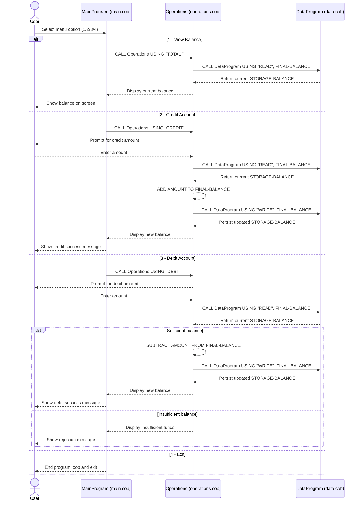

# Student Account COBOL Documentation

## Overview
This document explains the COBOL programs in `src/cobol` that implement a simple student account management flow. The system allows a user to view a student account balance, credit funds, and debit funds.

## COBOL File Purposes

### `main.cob` (`PROGRAM-ID. MainProgram`)
- Acts as the command-line entry point for the student account application.
- Displays a menu loop with these options:
  - `1` View Balance
  - `2` Credit Account
  - `3` Debit Account
  - `4` Exit
- Translates menu choices into operation calls to `Operations`:
  - `1` -> `TOTAL `
  - `2` -> `CREDIT`
  - `3` -> `DEBIT `
- Repeats until the user selects Exit.

### `operations.cob` (`PROGRAM-ID. Operations`)
- Contains the core account transaction logic.
- Accepts one operation code from `MainProgram` via linkage (`PASSED-OPERATION`).
- Reads and writes account balance through `DataProgram` calls.

Key operational branches:
- `TOTAL `
  - Calls `DataProgram` with `READ`.
  - Displays current student account balance.
- `CREDIT`
  - Prompts for credit amount.
  - Reads current balance (`READ`), adds amount, writes updated balance (`WRITE`).
  - Displays the new balance.
- `DEBIT `
  - Prompts for debit amount.
  - Reads current balance.
  - Debits only if balance is sufficient.
  - Writes updated balance on success; otherwise displays an insufficient funds message.

### `data.cob` (`PROGRAM-ID. DataProgram`)
- Simulates a persistence/data-access layer for account balance.
- Stores current balance in working storage (`STORAGE-BALANCE`), initialized to `1000.00`.
- Exposes a simple operation interface through linkage arguments:
  - `READ` returns current stored balance.
  - `WRITE` updates stored balance with passed value.

## Key Functions and Interactions
- `MainProgram` controls user interaction and routing.
- `Operations` applies business rules for each transaction type.
- `DataProgram` is responsible for getting/setting the balance value.

Call flow:
1. User selects action in `MainProgram`.
2. `MainProgram` calls `Operations` with operation code.
3. `Operations` calls `DataProgram` to `READ` current balance.
4. `Operations` performs transaction logic.
5. If needed, `Operations` calls `DataProgram` with `WRITE` to persist new balance.

## Student Account Business Rules
- **Starting balance**: Student account opens with `1000.00` (default in `DataProgram`).
- **Balance inquiry**: Viewing balance does not modify account data.
- **Credit rule**: Credit amount is added directly to the current balance.
- **Debit rule**: Debit is only allowed when `balance >= debit amount`.
- **Insufficient funds handling**: If debit exceeds current balance, transaction is rejected and balance remains unchanged.
- **Operation contract**: Valid operation codes expected across modules are fixed-width values: `TOTAL `, `CREDIT`, `DEBIT `, `READ`, and `WRITE`.

## Notes for Modernization
- The current balance is in-memory program state, not external storage; data persistence is limited to runtime context.
- Validation for negative or non-numeric amounts is not implemented and may be added in future improvements.

## Sequence Diagram (Data Flow)

